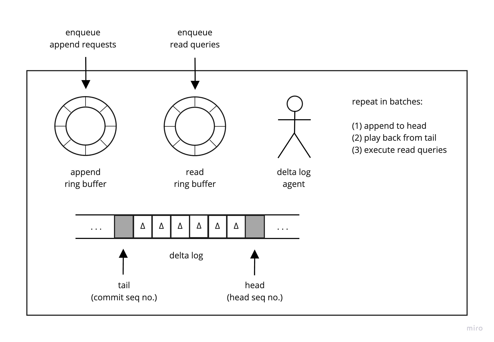
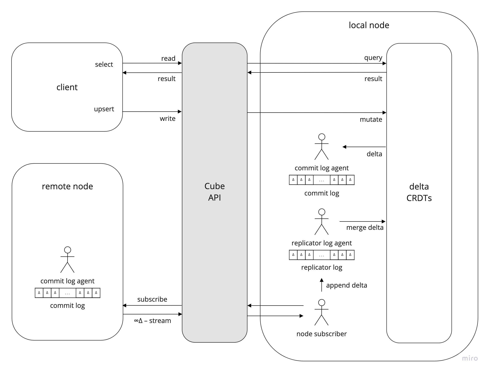

# Cube

Even if you don't believe in the [singularity](https://en.wikipedia.org/wiki/Technological_singularity) or [simulation hypothesis](https://en.wikipedia.org/wiki/Simulation_hypothesis), you still want your personal information secure in the advent of post-quantum cryptography. So best to hold your data in a system designed to scale as the singularity does without having to redesign its core principles. You probably want a system that is able to scale in time and space, works with the fundamental rules of the universe for efficiency (such as the nature of spacetime and causality) and won't require redesign when things start to get really weird.

## Design

Distributed computing systems are vital for the economy, health services and global security. A key question in distributed system design is how to gracefully handle a network partition. For example, a global system may need to remain available even if internet connectivity is cut off between different parts of the world.

Cube is a lightweight framework for distributed computing designed around the [CAP theorem](https://en.wikipedia.org/wiki/CAP_theorem). The distributed computing system is modeled as a graph, where nodes represent servers and edges represent internet connectivity. The CAP theorem requires engineers to choose between strong consistency or high availability. In the event of a network partition, to guarantee high availability, consistency in Cube is eventual. Following a network partition, the two independent sides of the network will remain available. Once the partition heals, the network will exchange and merge data to restore synchronicity. However, the two partitions will remain inconsistent until merged, yet are able to operate fully independently until reconnected.

## CRDTs

Cube uses conflict-free replicated data types (CRDTs) to synchronize data between nodes. The aim is for each node to eventually get a full copy of all data entered into the network. A good [mental visualization](https://mwhittaker.github.io/consistency_in_distributed_systems/1_baseball.html) for CRDTs is waves of data exchanged between nodes in a network (or messages between the stars). Eventually the waves settle down and the state of each node is synchronized and consistent.

In parallel and distributed computing, CRDTs guarantee eventual consistency of data in large-scale systems, despite messages being duplicated or arriving out of sequence. In 2016, Paulo Sergio Almeida discovered [delta CRDTs](https://arxiv.org/pdf/1603.01529.pdf)—simple yet optimized mathematical structures for propagating data between nodes in a global network, based on queries, mutations and deltas. Separating reads and writes, CRDTs may be queried or mutated to produce deltas. A delta is the result of a mutation (distinct from the mutation itself) and is broadcast between nodes to ensure synchronicity.



Each node holds an append-only commit log that records the deltas resulting from all mutations made locally to that node. Remote nodes subscribe to the commit log, which is returned as an infinite delta event stream (starlight from a star). The remote nodes each hold a replica of all other nodes in the system, ensuring eventual consistency.



Not every data structure can be easily adapted to become a CRDT. Mathematically, CRDTs are based on [semi-lattice theory](https://en.wikipedia.org/wiki/Join_and_meet), and to be considered a CRDT, a data structure must satisfy certain [mathematical constraints](https://en.wikipedia.org/wiki/Semilattice). A list of currently known CRDTs is available [here](https://en.wikipedia.org/wiki/Conflict-free_replicated_data_type#Known_CRDTs).

## Distributed Tables

[Google Sheets](https://josephg.com/blog/crdts-are-the-future/) allows users from anywhere in the world to edit virtually infinite two-dimensional arrays of data and see each other's edits in real time through eventual consistency. For a group of users editing a spreadsheet together in real time, changes may be sent between users out of sequence, as networks are unreliable. If  the group of users becomes split into two subgroups due to a network partition, each subgroup can collaboratively edit the sheet together and the spreadsheet will be merged and remain consistent once the network partition heals.

For relational data, Cube uses causal CRDTs that consider the [causal history](https://en.wikipedia.org/wiki/World_line) of the event that mutated the data. The exchange of deltas by CRDTs in Cube is analogous to the exchange of edits while working on a shared global spreadsheet.

## Unique Identifiers

Inspired by Twitter's [Snowflake ID](https://en.wikipedia.org/wiki/Snowflake_ID), Cube uses 128-bit spacetime IDs to uniquely identify delta events in spacetime. For space, the spacetime ID encodes the node's location in the data center and a sequence number for the location on disk that holds the information content of the delta. If a CRDT receives duplicate deltas or deltas out of sequence, the spacetime IDs can be used to resolve conflicts by picking the delta that is closest to the node in space and time. Time is represented by milliseconds since a new universal epoch, January 1st, 2020 UTC. Details on this encoding scheme can be found [here](https://github.com/Lyferise/cube/blob/master/cube-core/src/main/java/com/lyferise/cube/events/SpacetimeId.java).

Both spacetime IDs and [UUIDs](https://en.wikipedia.org/wiki/Universally_unique_identifier) are globally unique 128-bit identifiers. Spacetime IDs are used for events local to a node that are broadcast globally. UUIDs are used in other contexts, e.g., a query correlation ID generated by a client application.

## Cryptography

Cube uses a variant of SHA-256, which is believed to be secure against [quantum cryptography attacks](https://en.wikipedia.org/wiki/Post-quantum_cryptography), protecting the system in the event of a [singularity](https://en.wikipedia.org/wiki/Technological_singularity). Don't worry, your data is safe. Oh, we're also building on spacetime IDs so in case [femtotechnology](https://en.wikipedia.org/wiki/Femtotechnology) kicks off we can scale all the way down to the universe's underlying [quantum semi-lattice](https://www.quantamagazine.org/how-space-and-time-could-be-a-quantum-error-correcting-code-20190103).

## How do I talk to Cube?

Cube uses a subset of [standard SQL](https://en.wikipedia.org/wiki/SQL) through [data virtualization](https://en.wikipedia.org/wiki/Data_virtualization).

## Code

Cube uses a Git [monorepo](https://en.wikipedia.org/wiki/Monorepo), structured as a Gradle/IntelliJ multi-module project. Each module builds as a separate JAR, but are included in a [multi-module project](https://docs.gradle.org/current/userguide/multi_project_builds.html) for convenience, as well as to aid source code navigation and local debugging.

- `cube-cli`
- `cube-client`
- `cube-cluster`
- `cube-core`
- `cube-lang`

### Prerequisites

- [JDK 14.0.2](https://www.oracle.com/java/technologies/javase/jdk14-archive-downloads.html)
- [Gradle 7.0](https://gradle.org/releases)
- [MySQL 8.0.25](https://dev.mysql.com/downloads/mysql)

### Building from Source

```
./gradlew uberJar
cd cube-cluster/build/libs
java -jar lyferise-cube-1.666.jar
```
